# New-LMS

> Platform Learning Management System (LMS) berbasis web untuk memfasilitasi interaksi akademik antara siswa, pengajar, dan admin dalam pengelolaan kelas, distribusi materi ajar, serta pengumpulan dan penilaian tugas secara terpusat.

---

## 1. Status Proyek

Status saat ini: **Fase Pengembangan Aktif (Core Features Implemented)**.

- **Sudah Berjalan:** Autentikasi multi-peran (Admin, Teacher, Student) dengan JWT, alur persetujuan akun pengajar oleh admin, manajemen kelas dengan kode akses, unggah-unduh materi pembelajaran, serta alur pengumpulan dan penilaian tugas.
- **Belum Diimplementasikan:** Integrasi AI, otomatisasi migrasi database, dan pemulihan kata sandi mandiri.

---

## 2. Tentang Proyek

New-LMS adalah aplikasi web yang dirancang untuk mempermudah kegiatan belajar-mengajar secara terstruktur dalam satu platform terpadu. Pengajar dapat membuat kelas, membagikan modul ajar digital, serta memberikan penugasan dengan tenggat waktu yang jelas kepada siswa. Siswa dapat mendaftar ke kelas menggunakan kode akses unik, mengunduh materi belajar, dan mengumpulkan tugas langsung melalui antarmuka web. Sistem ini juga dilengkapi verifikasi admin untuk memastikan hanya pengajar yang sah yang dapat mengelola kelas dan materi.

---

## 3. Tampilan Aplikasi

> 📷 **[Tempat screenshot: Halaman Login & Registrasi Multi-Peran]** 

<!--  -->

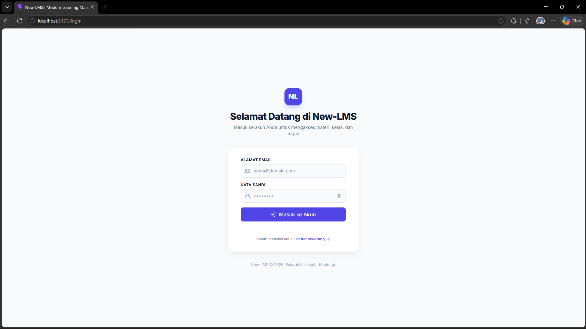

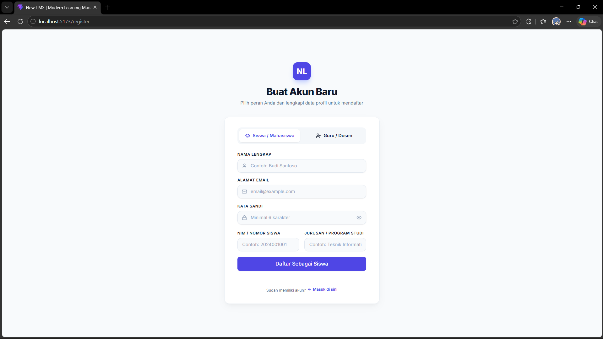

Menampilkan antarmuka masuk dan pendaftaran akun dengan pemisahan peran Siswa (NIM & Jurusan) serta Pengajar.

> 📷 **[Tempat screenshot: Panel Persetujuan Akun Guru oleh Admin]** 

<!--  -->

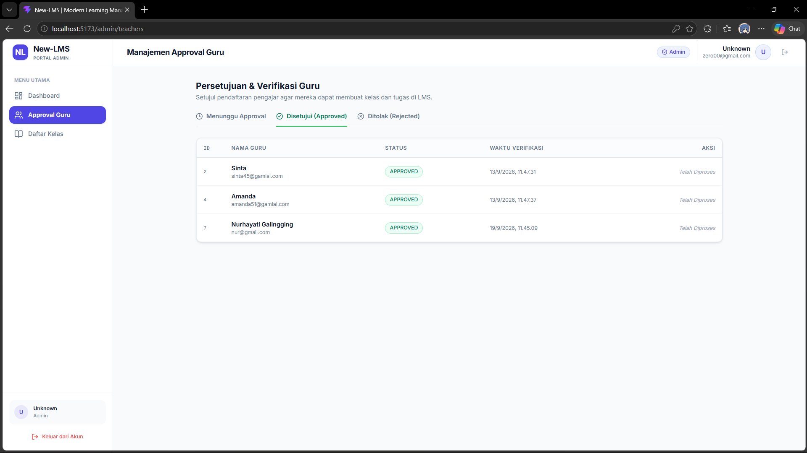

Menampilkan dashboard admin untuk meninjau status pendaftaran pengajar (*pending*, *approved*, *rejected*) dan daftar kelas aktif.

> 📷 **[Tempat screenshot: Manajemen Kelas & Materi Pengajar]** 

<!--  -->

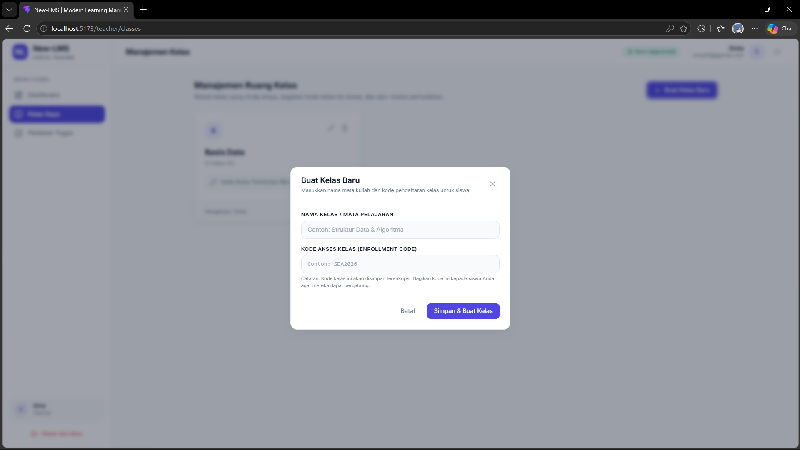

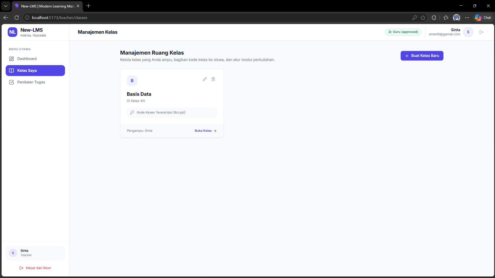

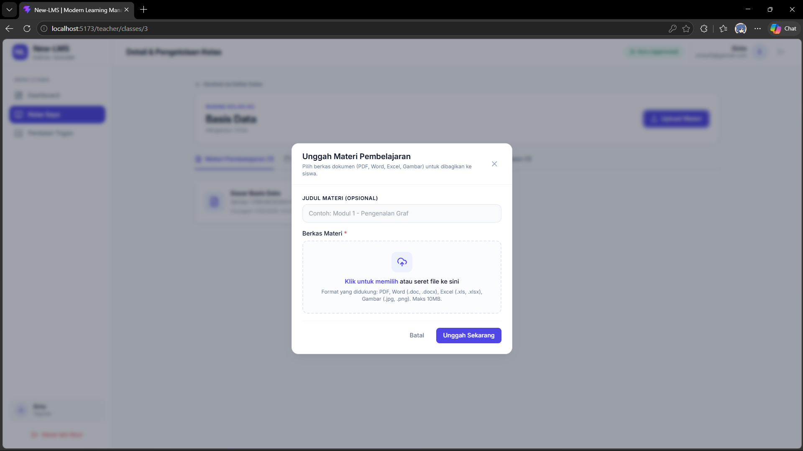

Menampilkan daftar kelas yang diampu pengajar, pembuatan kode akses kelas, dan antarmuka unggah modul materi pelajaran.

> 📷 **[Tempat screenshot: Penilaian dan Umpan Balik Tugas]** 
> 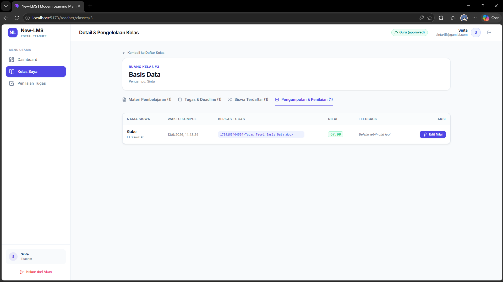

<!--  -->

Menampilkan tabel berkas tugas siswa yang masuk beserta formulir pengisian nilai (skala 0–100) dan catatan evaluasi.

> 📷 **[Tempat screenshot: Portal Siswa (Eksplorasi Kelas & Riwayat Nilai)]** 
> 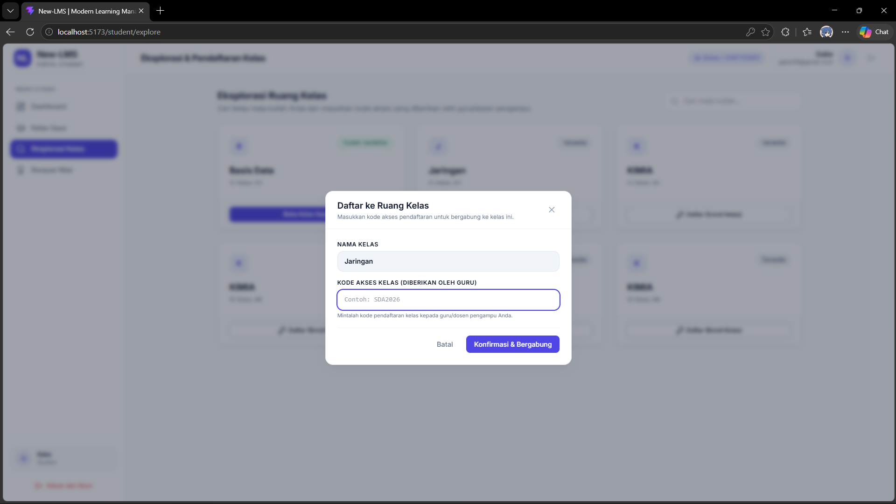
> 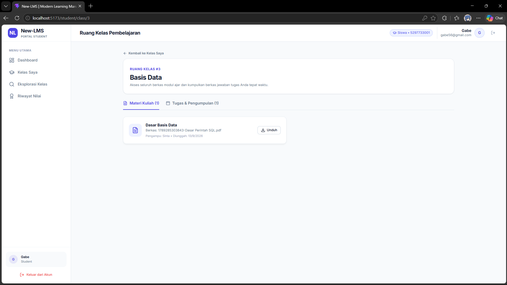
> 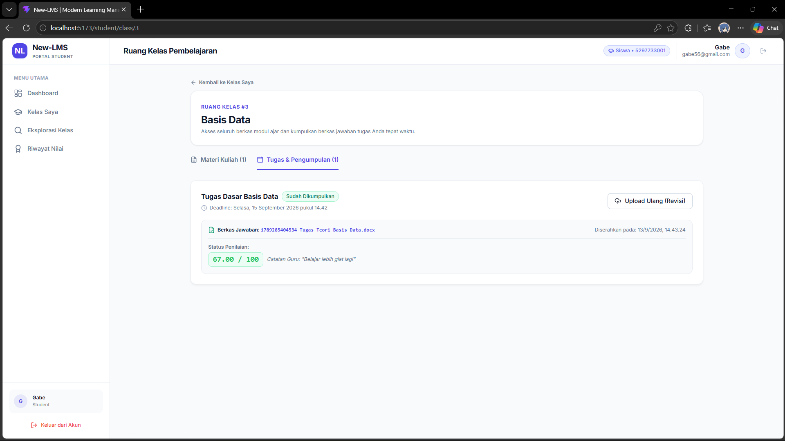

<!--  -->

Menampilkan antarmuka siswa untuk bergabung ke kelas, mengakses materi modul, mengumpulkan berkas tugas, dan memantau nilai.

---

## 4. Fitur Utama

- **Autentikasi & Hak Akses Berjenjang (RBAC):** Membatasi akses antarmuka dan endpoint data sesuai peran pengguna (Admin, Pengajar, Siswa) menggunakan JSON Web Token.
- **Verifikasi Pengajar oleh Admin:** Memvalidasi akun pengajar baru melalui mekanisme persetujuan (*approval*) sebelum pengajar diizinkan membuat kelas.
- **Pendaftaran Kelas Berbasis Kode Akses:** Menjaga privasi kelas dengan pencocokan kode masuk yang disimpan secara aman menggunakan *hashing* Bcrypt.
- **Distribusi Materi Pembelajaran:** Memfasilitasi pengajar mengunggah dokumen referensi (PDF, Word, dll.) untuk diunduh langsung oleh siswa terdaftar.
- **Pengumpulan & Penilaian Tugas:** Menyediakan alur penyerahan berkas tugas oleh siswa serta pemberian nilai dan umpan balik oleh pengajar.

---

## 5. Teknologi yang Digunakan

- **Bahasa Pemrograman:** JavaScript (Node.js & Browser ES Modules)
- **Frontend:** React 19, Vite 8, React Router v7, Tailwind CSS v3, Axios, Lucide React, React Hot Toast
- **Backend:** Node.js, Express.js v5, MySQL2 (Connection Pool)
- **Keamanan & Utilitas:** JSON Web Token (jsonwebtoken), Bcrypt, Multer (File Upload), Express Rate Limit, Morgan, Concurrently

---

## 6. Alur Singkat Sistem

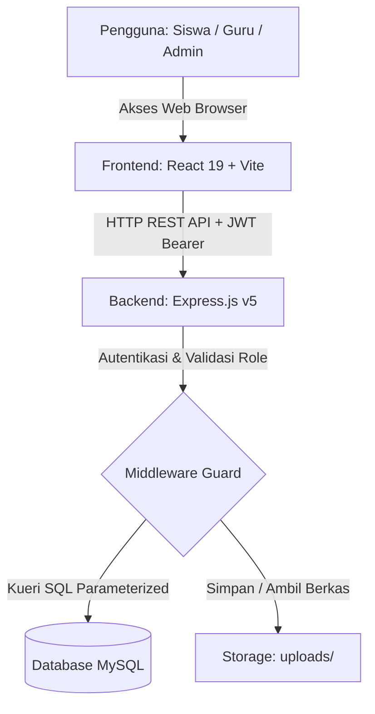

---

## 7. Cara Menjalankan

### Prasyarat

- Node.js (versi rekomendasi LTS) & npm
- Server MySQL aktif

### Langkah Instalasi

1. **Klon Repositori & Pasang Dependensi:**

   ```bash
   git clone [ISI: URL repositori git jika ada]
   cd New-LMS
   npm install
   npm install --prefix backend
   npm install --prefix frontend
   ```
2. **Konfigurasi Environment:**

   - Siapkan file `.env` di dalam folder `backend/` dengan variabel:
     ```env
     PORT=5000
     DB_HOST=localhost
     DB_PORT=3306
     DB_USER=root
     DB_PASSWORD=
     DB_NAME=[ISI: nama_database_lms]
     JWT_SECRET=[ISI: secret_key_jwt]
     FRONTEND_URL=http://localhost:5173
     ```
   - Siapkan file `.env` di dalam folder `frontend/` dengan variabel:
     ```env
     VITE_API_BASE_URL=http://localhost:5000/api
     ```
3. **Inisialisasi Database:**

   - Impor skema tabel relasional (`users`, `teachers`, `students`, `classes`, `enrollments`, `materials`, `assignments`, `submissions`) ke dalam database MySQL.
4. **Menjalankan Aplikasi:**

   - Menjalankan backend dan frontend bersamaan dari root:
     ```bash
     npm run dev
     ```
   - Atau dijalankan secara terpisah:
     ```bash
     # Terminal 1 - Backend (http://localhost:5000)
     npm run backend

     # Terminal 2 - Frontend (http://localhost:5173)
     npm run frontend
     ```

---

## 8. Struktur Folder

```text
New-LMS/
├── backend/
│   ├── src/
│   │   ├── config/          # Inisialisasi koneksi pool database MySQL
│   │   ├── controllers/     # Logika bisnis penanganan endpoint API
│   │   ├── middlewares/     # Verifikasi JWT, role guard, dan multer upload
│   │   ├── models/          # Abstraksi kueri database
│   │   ├── routes/          # Definisi rute REST API per modul
│   │   └── uploads/         # Folder penyimpanan fisik berkas tugas dan materi
│   └── package.json
├── frontend/
│   ├── src/
│   │   ├── api/             # Konfigurasi client Axios
│   │   ├── components/      # Komponen UI bersama dan layout dashboard
│   │   ├── context/         # AuthContext untuk state manajemen login
│   │   ├── pages/           # Tampilan antarmuka (Admin, Teacher, Student, Auth)
│   │   └── routes/          # Konfigurasi perutean React Router
│   └── package.json
├── docs/screenshots/        # Berkas tangkapan layar antarmuka
└── package.json             # Skrip root untuk menjalankan aplikasi secara konkuren
```

---

## 9. Rencana Pengembangan

- [ ] [ISI: rencana pengembangan AI yang ditargetkan pemilik, misal: asisten evaluasi esai otomatis] *(Belum diimplementasikan)*
- [ ] Skrip migrasi dan *seeding* database otomatis *(Belum diimplementasikan)*
- [ ] Integrasi penyimpanan awan (Cloud Storage) untuk file berkas materi dan tugas *(Belum diimplementasikan)*
- [ ] Layanan notifikasi email untuk tenggat waktu tugas dan persetujuan akun *(Belum diimplementasikan)*

---

## 10. Peran dan Kontribusi

- [ISI: peranku dan lapisan yang kukerjakan, misal: Fullstack Developer yang bertanggung jawab pada perancangan arsitektur REST API backend, skema relasional MySQL, serta integrasi komponen dashboard antarmuka React]

---

## 11. Penggunaan AI dalam Pengembangan

- [ISI: tool apa dan untuk apa, misal: bantuan perancangan dokumentasi arsitektur, penyusunan kueri optimasi database, atau refaktorisasi komponen antarmuka]
