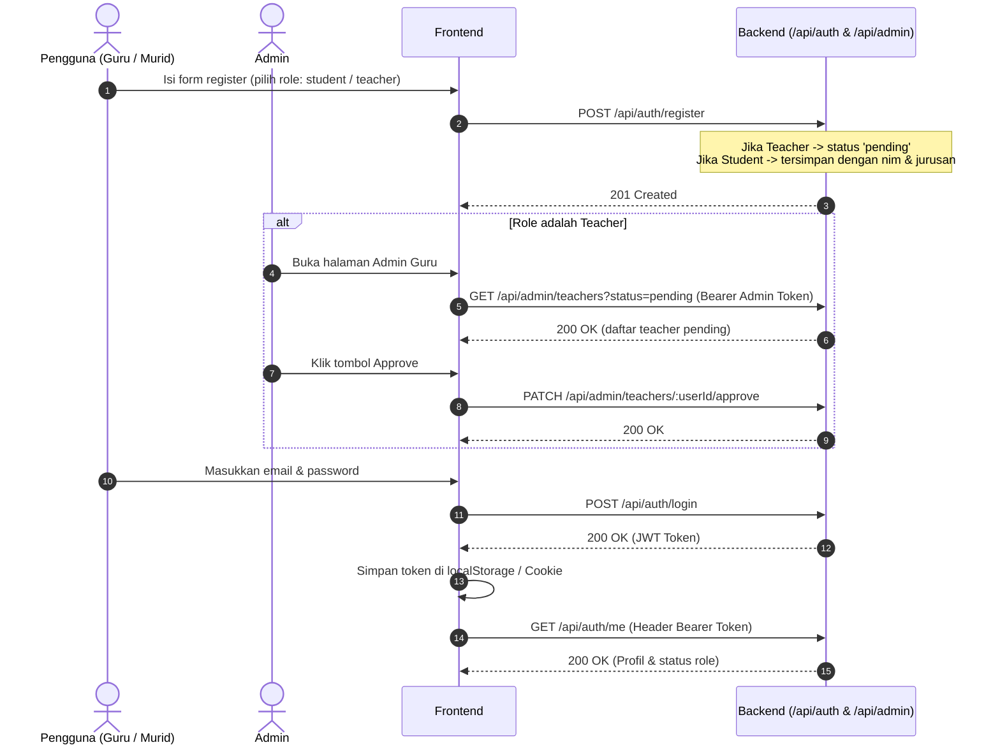
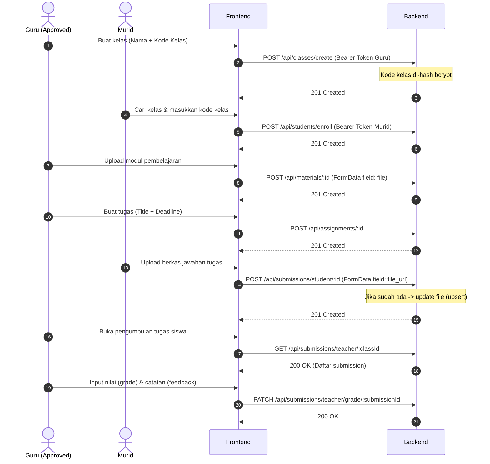

# BACKEND API DOCUMENTATION - NEW LMS

Dokumentasi teknis menyeluruh untuk backend sistem New-LMS (Learning Management System). Dihasilkan berdasarkan analisis komprehensif dari source code (`routes`, `controllers`, `models`, `middlewares`, `config`, dan skema database MySQL aktual).

---

## 1. RINGKASAN PROJECT

### Tech Stack
- **Runtime Environment:** Node.js (CommonJS module system)
- **Framework:** Express.js (`v5.2.1`)
- **Database:** MySQL / MariaDB (`mysql2 v3.23.2` connection pool)
- **ORM / Query Method:** Raw SQL queries dengan parameter binding (`mysql2/promise` tidak digunakan, menggunakan callback pattern dengan error handler util)
- **Autentikasi & Keamanan:** 
  - `jsonwebtoken` (`v9.0.3`): Otentikasi berbasis JWT (JSON Web Token) dengan masa berlaku 1 hari (`1d`)
  - `bcrypt` (`v6.0.0`): Hashing password dan hashing kode kelas (salt rounds: 10)
  - `express-rate-limit` (`v8.6.2`): Rate limiter (terpasang di rute auth)
  - `cors` (`v2.8.6`): Pengaturan CORS berbasis origin (`FRONTEND_URL`) dengan `credentials: true`
- **File Upload:** `multer` (`v2.2.0` diskStorage)
- **Environment Management:** `dotenv` (`v17.4.2`)
- **Dev Tooling:** `nodemon` (`v3.1.14`)

### Tujuan & Fungsi Utama Aplikasi
Aplikasi ini merupakan backend **Learning Management System (LMS)** multi-peran (Admin, Guru/Teacher, dan Murid/Student) dengan alur kerja sebagai berikut:
1. **Manajemen Pengguna & Verifikasi:** Pendaftaran mandiri untuk Student dan Teacher. Akun Teacher berstatus `pending` dan wajib diverifikasi/disetujui oleh Admin (`approved` / `rejected`) sebelum dapat membuat kelas, membagikan materi, atau memberi tugas.
2. **Manajemen Kelas:** Teacher yang telah diverifikasi dapat membuat, mengedit nama, dan menghapus kelas, disertai pembuatan kode kelas (disimpan terenkripsi). Student dapat melihat daftar kelas, melakukan pendaftaran (enroll) ke dalam kelas, melihat kelas yang diikutinya, serta membatalkan pendaftaran (unenroll).
3. **Materi Pembelajaran (Materials):** Teacher dapat mengunggah file modul pembelajaran (PDF, Word, Excel, Gambar, dll). Student dan Teacher dapat melihat daftar materi di suatu kelas serta mengunduh file materi.
4. **Tugas & Pengumpulan (Assignments & Submissions):** Teacher dapat membuat, mengubah, dan menghapus tugas dengan batas waktu (deadline). Student dapat mengunggah file tugas (pengumpulan mendukung mekanisme revisi/upsert). Teacher dapat meninjau semua pengumpulan tugas pada kelasnya, memberikan nilai (grade 0-100), dan umpan balik (feedback).

### Struktur Folder Backend
```text
backend/
├── .env                       # Environment variable (DB, JWT, Port, Frontend URL)
├── package.json               # Dependensi dan skrip (npm run dev, npm start)
└── src/
    ├── app.js                 # Entry point: inisialisasi Express, CORS, routing, error handling
    ├── config/
    │   └── db.js              # Inisialisasi MySQL connection pool (mysql2)
    ├── controllers/
    │   ├── AdminController.js       # List teacher by status, approve, reject
    │   ├── AssignmentController.js  # CRUD tugas untuk guru dan akses tugas untuk murid
    │   ├── AuthController.js        # Register, login, dan profil user saat ini (/me)
    │   ├── ClassController.js       # CRUD kelas (create, list, show, update, delete)
    │   ├── EnrollmentController.js  # Enroll kelas, unenroll, dan list siswa per kelas
    │   ├── MaterialsController.js   # Upload, list materi kelas, download file materi
    │   └── SubmissionController.js  # Submit tugas (upsert), list pengumpulan, penilaian (grading)
    ├── middlewares/
    │   ├── AuthMiddleware.js        # verifyToken (JWT) & checkRole(...roles)
    │   ├── TeacherMiddleware.js     # teacherApproved (validasi status approval guru di DB)
    │   └── UploadMiddlewares.js     # Multer diskStorage, filter tipe file, limit ukuran 10MB
    ├── models/
    │   ├── classModel.js            # Query helper untuk filter kelas per role
    │   └── userModel.js             # Query helper pencarian role user
    ├── routes/
    │   ├── AdminRoute.js            # Prefix /api/admin
    │   ├── AssignmentRoute.js       # Prefix /api/assignments
    │   ├── AuthRoute.js             # Prefix /api/auth
    │   ├── ClassRoute.js            # Prefix /api/classes
    │   ├── EnrollmentRoute.js       # Prefix /api/students
    │   ├── MaterialsRoutes.js       # Prefix /api/materials
    │   └── SubmissionRoute.js       # Prefix /api/submissions
    ├── tes/
    │   ├── qwer.js                  # File kode uji/draft registrasi lama
    │   └── tes.js                   # File kosong (testing)
    ├── uploads/                     # Folder penyimpanan file fisik (materi & tugas)
    └── util/
        └── handleDbError.js         # Helper penanganan error respons database
```

---

## 2. AUTENTIKASI & OTORISASI

### Mekanisme Autentikasi
- Menggunakan **JSON Web Token (JWT)**.
- Saat login sukses (`POST /api/auth/login`), server mengembalikan token JWT yang ditandatangani dengan rahasia `JWT_SECRET`.
- Payload JWT berisi:
  ```json
  {
    "id": <user_id>,
    "role": "<student | teacher | admin>",
    "iat": 1773216000,
    "exp": 1773302400
  }
  ```
- Masa aktif token adalah 1 hari (`expiresIn: "1d"`).

### Cara Token Dikirim
- Token dikirim oleh client melalui HTTP Request Header:
  ```http
  Authorization: Bearer <token_jwt>
  ```
- Middleware `verifyToken` akan memisahkan kata `Bearer` dan mengambil string token pada index ke-1 (`authHeader.split(" ")[1]`). Jika header tidak disertakan, server merespons dengan HTTP 401 (`Access denied`). Jika token kadaluarsa atau tidak valid, server merespons dengan HTTP 401 (`Invalid token`). Data payload disimpan ke dalam `req.user`.

### Role & Level Akses
Sistem memiliki 3 role utama yang tercatat pada enum database:
1. **`admin`**:
   - Dapat melihat daftar seluruh kelas di sistem (`GET /api/classes/list`).
   - Mengelola persetujuan akun Teacher (`GET /api/admin/teachers`, `PATCH /api/admin/teachers/:userId/approve`, `PATCH /api/admin/teachers/:userId/reject`).
2. **`teacher`**:
   - Memerlukan status `approved` di tabel `teachers` untuk dapat menjalankan aksi tertentu (diperiksa oleh middleware `TeacherMiddleware.js`).
   - Dapat membuat, memperbarui, dan menghapus kelas miliknya.
   - Dapat mengunggah file materi ke kelasnya.
   - Dapat membuat, mengubah, dan menghapus tugas pada kelasnya.
   - Dapat melihat pengumpulan tugas dari siswa di kelasnya dan memberikan penilaian (grade + feedback).
3. **`student`**:
   - Memiliki data profil tambahan di tabel `students` (`nim`, `jurusan`).
   - Dapat melihat daftar kelas dan status apakah sudah terdaftar (`is_enrolled`).
   - Dapat mendaftar (`enroll`) ke kelas dengan memasukkan nama kelas & kode kelas, serta keluar (`unenroll`).
   - Dapat melihat kelas yang diikutinya (`/api/classes/myclasses`).
   - Dapat melihat tugas pada kelas yang diikutinya.
   - Dapat mengunggah file jawaban tugas (`submission`) dan melihat riwayat nilai/feedback miliknya.

---

## 3. DATA MODEL / SCHEMA

Struktur tabel database relasional (`MySQL / InnoDB`) yang digunakan di aplikasi:

### 1. Model: `users`
Tabel utama penyimpan kredensial seluruh pengguna sistem.

| Field | Tipe Data | Nullable | Key / Constraint | Keterangan |
|---|---|---|---|---|
| `id` | `INT(11)` | No | PRIMARY KEY, AUTO_INCREMENT | Identifier unik pengguna |
| `name` | `VARCHAR(100)` | No | - | Nama lengkap pengguna |
| `email` | `VARCHAR(100)` | No | UNIQUE (`email`) | Alamat email unik untuk login |
| `password` | `VARCHAR(255)` | No | - | Password yang di-hash dengan bcrypt |
| `role` | `ENUM('student','teacher','admin')` | No | DEFAULT `'student'` | Peran pengguna |
| `created_at` | `TIMESTAMP` | No | DEFAULT `CURRENT_TIMESTAMP` | Waktu registrasi akun |

**Relasi:**
- `users.id` 1-to-1 ke `students.student_id` (ON DELETE CASCADE, ON UPDATE CASCADE)
- `users.id` 1-to-1 ke `teachers.teacher_id` (ON DELETE CASCADE, ON UPDATE CASCADE)
- `users.id` 1-to-Many ke `teachers.approved_by` (ON DELETE SET NULL, ON UPDATE CASCADE)

---

### 2. Model: `students`
Menyimpan atribut khusus bagi pengguna dengan role `student`.

| Field | Tipe Data | Nullable | Key / Constraint | Keterangan |
|---|---|---|---|---|
| `student_id` | `INT(11)` | No | PRIMARY KEY, FK -> `users.id` | Merujuk ke ID tabel users |
| `nim` | `VARCHAR(20)` | No | UNIQUE (`nim`) | Nomor Induk Mahasiswa/Siswa |
| `jurusan` | `VARCHAR(100)` | No | - | Jurusan / Program Studi |

**Relasi:**
- One-to-One dengan `users` (`student_id` = `users.id`)
- One-to-Many dengan `enrollments` (`students.student_id` -> `enrollments.student_id`)
- One-to-Many dengan `submissions` (`students.student_id` -> `submissions.student_id`)

---

### 3. Model: `teachers`
Menyimpan status verifikasi dan jejak persetujuan admin untuk role `teacher`.

| Field | Tipe Data | Nullable | Key / Constraint | Keterangan |
|---|---|---|---|---|
| `teacher_id` | `INT(11)` | No | PRIMARY KEY, FK -> `users.id` | Merujuk ke ID tabel users |
| `status` | `ENUM('pending','approved','rejected')` | No | DEFAULT `'pending'` | Status persetujuan akun |
| `approved_by` | `INT(11)` | Yes | FK -> `users.id` | Admin yang menyetujui akun |
| `approved_at` | `TIMESTAMP` | Yes | DEFAULT `NULL` | Waktu persetujuan |

**Relasi:**
- One-to-One dengan `users` (`teacher_id` = `users.id`)
- Many-to-One dengan `users` sebagai verifikator (`approved_by` = `users.id`)
- One-to-Many dengan `classes` (`teachers.teacher_id` -> `classes.teacher_id`)

---

### 4. Model: `classes`
Data kelas yang dibuat oleh guru.

| Field | Tipe Data | Nullable | Key / Constraint | Keterangan |
|---|---|---|---|---|
| `id` | `INT(11)` | No | PRIMARY KEY, AUTO_INCREMENT | Identifier unik kelas |
| `name` | `VARCHAR(100)` | No | - | Nama mata pelajaran / kelas |
| `teacher_id` | `INT(11)` | No | FK -> `teachers.teacher_id` | ID guru pembuat kelas |
| `code` | `VARCHAR(50)` (atau `VARCHAR(255)` untuk hash) | Yes | - | Kode akses kelas (di-hash bcrypt) |

**Relasi:**
- Many-to-One ke `teachers` (`classes.teacher_id` -> `teachers.teacher_id`, ON DELETE CASCADE)
- One-to-Many ke `enrollments` (`classes.id` -> `enrollments.class_id`, ON DELETE CASCADE)
- One-to-Many ke `materials` (`classes.id` -> `materials.class_id`, ON DELETE CASCADE)
- One-to-Many ke `assignments` (`classes.id` -> `assignments.class_id`, ON DELETE CASCADE)

---

### 5. Model: `enrollments`
Tabel relasi many-to-many antara siswa (`students`) dan kelas (`classes`).

| Field | Tipe Data | Nullable | Key / Constraint | Keterangan |
|---|---|---|---|---|
| `id` | `INT(11)` | No | PRIMARY KEY, AUTO_INCREMENT | ID enrollment |
| `class_id` | `INT(11)` | No | FK -> `classes.id` | ID kelas yang diikuti |
| `student_id` | `INT(11)` | No | FK -> `students.student_id` | ID siswa peserta |
| `enrolled_at` | `TIMESTAMP` | No | DEFAULT `CURRENT_TIMESTAMP` | Waktu pendaftaran |

**Constraint Tambahan:**
- `UNIQUE KEY uq_enrollment (class_id, student_id)`: Mencegah siswa mendaftar lebih dari satu kali ke kelas yang sama.

---

### 6. Model: `materials`
Materi pembelajaran yang diunggah oleh guru pada kelas tertentu.

| Field | Tipe Data | Nullable | Key / Constraint | Keterangan |
|---|---|---|---|---|
| `id` | `INT(11)` | No | PRIMARY KEY, AUTO_INCREMENT | ID materi |
| `class_id` | `INT(11)` | No | FK -> `classes.id` | ID kelas pemilik materi |
| `title` | `VARCHAR(255)` | Yes | - | Judul materi pembelajaran |
| `file_url` | `VARCHAR(255)` | Yes | - | Nama file fisik di folder uploads |
| `uploaded_at` | `TIMESTAMP` | No | DEFAULT `CURRENT_TIMESTAMP` | Waktu upload |

**Relasi:**
- Many-to-One ke `classes` (`materials.class_id` -> `classes.id`, ON DELETE CASCADE)

---

### 7. Model: `assignments`
Tugas yang diberikan guru di dalam suatu kelas.

| Field | Tipe Data | Nullable | Key / Constraint | Keterangan |
|---|---|---|---|---|
| `id` | `INT(11)` | No | PRIMARY KEY, AUTO_INCREMENT | ID tugas |
| `title` | `VARCHAR(150)` | No | - | Judul tugas |
| `class_id` | `INT(11)` | No | FK -> `classes.id` | ID kelas pemilik tugas |
| `deadline` | `DATETIME` | No | - | Batas waktu pengumpulan |

**Relasi:**
- Many-to-One ke `classes` (`assignments.class_id` -> `classes.id`, ON DELETE CASCADE)
- One-to-Many ke `submissions` (`assignments.id` -> `submissions.assignment_id`, ON DELETE CASCADE)

---

### 8. Model: `submissions`
Pengumpulan berkas tugas oleh siswa beserta penilaian dari guru.

| Field | Tipe Data | Nullable | Key / Constraint | Keterangan |
|---|---|---|---|---|
| `id` | `INT(11)` | No | PRIMARY KEY, AUTO_INCREMENT | ID submission |
| `assignment_id` | `INT(11)` | No | FK -> `assignments.id` | ID tugas yang dikerjakan |
| `student_id` | `INT(11)` | No | FK -> `students.student_id` | ID siswa yang mengumpulkan |
| `file_url` | `VARCHAR(255)` | No | - | Nama file tugas di folder uploads |
| `submitted_at` | `TIMESTAMP` | No | DEFAULT `CURRENT_TIMESTAMP` | Waktu upload pengumpulan |
| `grade` | `DECIMAL(5,2)` | Yes | DEFAULT `NULL` | Nilai angka tugas (0 - 100) |
| `feedback` | `TEXT` | Yes | DEFAULT `NULL` | Catatan/komentar dari guru |

**Constraint Tambahan:**
- `UNIQUE KEY uq_submission (assignment_id, student_id)`: Memungkinkan query `ON DUPLICATE KEY UPDATE` saat siswa melakukan upload ulang tugas.

---

## 4. DAFTAR ENDPOINT LENGKAP

### A. Root / Health Check

#### 1. Server Health Check
- **Method & Path:** `GET /`
- **Deskripsi:** Memeriksa apakah server backend sedang berjalan.
- **Autentikasi:** Tidak
- **URL Parameters:** Tidak ada
- **Query Parameters:** Tidak ada
- **Request Body:** Tidak ada
- **Response Sukses:**
  - Status: `200 OK`
  ```json
  {
    "success": true,
    "message": "API is running"
  }
  ```
- **Response Gagal/Error:** Tidak ada (global handler `500` jika server crash)

---

### B. Modul Autentikasi (`/api/auth`)

#### 1. Registrasi Akun Baru
- **Method & Path:** `POST /api/auth/register`
- **Deskripsi:** Mendaftarkan pengguna baru dengan peran `student` atau `teacher`. Jika mendaftar sebagai `student`, data disimpan ke tabel `users` dan `students`. Jika `teacher`, data disimpan ke `users` dan `teachers` dengan status default `pending`.
- **Autentikasi:** Tidak
- **Middleware:** `limiter` (Catatan: pada rute, limiter diposisikan setelah controller).
- **Request Body (JSON):**
  - Untuk role `student`:
    ```json
    {
      "name": "Budi Santoso",
      "email": "budi@example.com",
      "password": "password123",
      "role": "student",
      "nim": "2024001001",
      "jurusan": "Teknik Informatika"
    }
    ```
  - Untuk role `teacher`:
    ```json
    {
      "name": "Ahmad Dani, M.Kom",
      "email": "ahmad@example.com",
      "password": "password123",
      "role": "teacher"
    }
    ```
- **Spesifikasi Field:**
  - `name` (string, wajib)
  - `email` (string, wajib, format email)
  - `password` (string, wajib)
  - `role` (string, wajib, pilihan: `"student"` atau `"teacher"`)
  - `nim` (string, wajib jika role = student)
  - `jurusan` (string, wajib jika role = student)
- **Response Sukses:**
  - Status: `201 Created`
  ```json
  {
    "message": "User registered successfully"
  }
  ```
- **Response Gagal/Error:**
  - Status: `400 Bad Request` (Role tidak valid):
    ```json
    {
      "message": "Invalid role"
    }
    ```
  - Status: `500 Internal Server Error` (Email duplikat / Database error):
    ```json
    {
      "success": false,
      "message": "DB error",
      "error": "Duplicate entry 'budi@example.com' for key 'email'"
    }
    ```

---

#### 2. Login Pengguna
- **Method & Path:** `POST /api/auth/login`
- **Deskripsi:** Memverifikasi email dan password pengguna, lalu mengembalikan token JWT jika cocok.
- **Autentikasi:** Tidak
- **Middleware:** `limiter`
- **Request Body (JSON):**
  ```json
  {
    "email": "budi@example.com",
    "password": "password123"
  }
  ```
- **Spesifikasi Field:**
  - `email` (string, wajib)
  - `password` (string, wajib)
- **Response Sukses:**
  - Status: `200 OK`
  ```json
  {
    "message": "Login successful",
    "token": "eyJhbGciOiJIUzI1NiIsInR5cCI6IkpXVCJ9..."
  }
  ```
- **Response Gagal/Error:**
  - Status: `400 Bad Request` (Field kosong):
    ```json
    {
      "message": "Email and password are required"
    }
    ```
  - Status: `404 Not Found` (Email tidak terdaftar):
    ```json
    {
      "message": "User not found"
    }
    ```
  - Status: `401 Unauthorized` (Password salah):
    ```json
    {
      "message": "Invalid password"
    }
    ```
  - Status: `500 Internal Server Error`:
    ```json
    {
      "success": false,
      "message": "DB error",
      "error": "..."
    }
    ```

---

#### 3. Mengambil Profil Pengguna Saat Ini
- **Method & Path:** `GET /api/auth/me`
- **Deskripsi:** Mendapatkan detail identitas profil pengguna yang sedang login berdasarkan token JWT.
- **Autentikasi:** Ya (`verifyToken`)
- **Role Akses:** `student`, `teacher` (Catatan: jika role pengguna adalah `admin`, endpoint ini saat ini tidak mengirimkan respon / hanging, lihat catatan frontend).
- **Header:** `Authorization: Bearer <token>`
- **Request Body:** Tidak ada
- **Response Sukses:**
  - Status: `200 OK` (Jika role = `student`):
    ```json
    {
      "id": 1,
      "name": "Budi Santoso",
      "email": "budi@example.com",
      "nim": "2024001001",
      "jurusan": "Teknik Informatika"
    }
    ```
  - Status: `200 OK` (Jika role = `teacher`):
    ```json
    {
      "id": 2,
      "name": "Ahmad Dani, M.Kom",
      "email": "ahmad@example.com",
      "status": "approved",
      "approved_at": "2026-09-11T07:15:30.000Z"
    }
    ```
- **Response Gagal/Error:**
  - Status: `401 Unauthorized`:
    ```json
    {
      "message": "Access denied"
    }
    ```
    atau
    ```json
    {
      "message": "Invalid token"
    }
    ```
  - Status: `404 Not Found`:
    ```json
    {
      "message": "User not found"
    }
    ```
  - Status: `500 Internal Server Error`:
    ```json
    {
      "code": "ER_BAD_FIELD_ERROR",
      "errno": 1054
    }
    ```

---

### C. Modul Admin (`/api/admin`)

#### 1. Mendapatkan Daftar Teacher Berdasarkan Status
- **Method & Path:** `GET /api/admin/teachers`
- **Deskripsi:** Menampilkan daftar akun guru yang difilter berdasarkan status verifikasi (`pending`, `approved`, atau `rejected`).
- **Autentikasi:** Ya (`verifyToken`, `checkRole("admin")`)
- **Role Akses:** `admin`
- **Query Parameters:**
  - `status` (string, **WAJIB**): status guru yang dicari, contoh: `?status=pending`
- **Request Body:** Tidak ada
- **Response Sukses:**
  - Status: `200 OK`
  ```json
  {
    "success": true,
    "data": [
      {
        "id": 2,
        "name": "Ahmad Dani, M.Kom",
        "email": "ahmad@example.com",
        "status": "pending",
        "approved_at": null
      }
    ]
  }
  ```
- **Response Gagal/Error:**
  - Status: `400 Bad Request` (Jika parameter `status` tidak disertakan):
    ```json
    {
      "message": "Status parameter is required"
    }
    ```
  - Status: `403 Forbidden` (Bukan role admin):
    ```json
    {
      "message": "Forbidden"
    }
    ```
  - Status: `500 Internal Server Error`:
    ```json
    {
      "success": false,
      "message": "DB error",
      "error": "..."
    }
    ```

---

#### 2. Menyetujui Akun Teacher (Approve)
- **Method & Path:** `PATCH /api/admin/teachers/:userId/approve`
- **Deskripsi:** Mengubah status akun teacher dari `pending` menjadi `approved`, mencatat ID admin yang menyetujui, dan menetapkan `approved_at` ke waktu sekarang.
- **Autentikasi:** Ya (`verifyToken`, `checkRole("admin")`)
- **Role Akses:** `admin`
- **URL Parameters:**
  - `userId` (integer, wajib): ID user teacher yang akan di-approve
- **Request Body:** Tidak ada
- **Response Sukses:**
  - Status: `200 OK`
  ```json
  {
    "success": true,
    "message": "teacher success approved"
  }
  ```
- **Response Gagal/Error:**
  - Status: `404 Not Found` (Teacher tidak ditemukan atau statusnya bukan 'pending'):
    ```json
    {
      "success": false,
      "message": "Teacher not found or already approved"
    }
    ```
  - Status: `500 Internal Server Error`:
    ```json
    {
      "success": false,
      "message": "Failed approve teacher",
      "error": "..."
    }
    ```

---

#### 3. Menolak Akun Teacher (Reject)
- **Method & Path:** `PATCH /api/admin/teachers/:userId/reject`
- **Deskripsi:** Mengubah status akun teacher dari `pending` menjadi `rejected`.
- **Autentikasi:** Ya (`verifyToken`, `checkRole("admin")`)
- **Role Akses:** `admin`
- **URL Parameters:**
  - `userId` (integer, wajib): ID user teacher yang akan ditolak
- **Request Body:** Tidak ada
- **Response Sukses:**
  - Status: `200 OK`
  ```json
  {
    "success": true,
    "message": "teacher success rejected"
  }
  ```
- **Response Gagal/Error:**
  - Status: `404 Not Found` (Teacher tidak ditemukan atau sudah diproses):
    ```json
    {
      "success": false,
      "message": "Teacher not found or already rejected"
    }
    ```
  - Status: `500 Internal Server Error`:
    ```json
    {
      "success": false,
      "message": "Failed rejected teacher",
      "error": "..."
    }
    ```

---

### D. Modul Kelas (`/api/classes`)

#### 1. Membuat Kelas Baru
- **Method & Path:** `POST /api/classes/create`
- **Deskripsi:** Membuat kelas baru oleh guru. Kode kelas otomatis di-hash dengan bcrypt sebelum disimpan ke database.
- **Autentikasi:** Ya (`verifyToken`, `checkRole("teacher")`, `teacherApproved`)
- **Role Akses:** `teacher` (status wajib `approved`)
- **Request Body (JSON):**
  ```json
  {
    "name": "Struktur Data & Algoritma",
    "code": "SDA2026"
  }
  ```
- **Spesifikasi Field:**
  - `name` (string, wajib, non-empty)
  - `code` (string, wajib, non-empty): kode enrollment kelas
- **Response Sukses:**
  - Status: `201 Created`
  ```json
  {
    "message": "Create class successfully"
  }
  ```
- **Response Gagal/Error:**
  - Status: `400 Bad Request`:
    ```json
    {
      "message": "Class name is required"
    }
    ```
    atau
    ```json
    {
      "message": "Class code is required"
    }
    ```
  - Status: `403 Forbidden` (Jika akun guru belum disetujui admin):
    ```json
    {
      "message": "Teacher account is waiting for approval"
    }
    ```
  - Status: `500 Internal Server Error`:
    ```json
    {
      "success": false,
      "message": "DB error",
      "error": "..."
    }
    ```

---

#### 2. Mendapatkan Daftar Semua Kelas (Tergantung Role)
- **Method & Path:** `GET /api/classes/list`
- **Deskripsi:** Menampilkan daftar kelas yang disesuaikan secara dinamis dengan role pemanggil:
  - **Student:** Menampilkan seluruh kelas beserta kolom boolean `is_enrolled` (1 jika siswa sudah bergabung, 0 jika belum).
  - **Teacher:** Menampilkan seluruh kelas yang diampu oleh guru tersebut beserta nama guru (`teacher_name`).
  - **Admin:** Menampilkan seluruh data baris dari tabel `classes`.
- **Autentikasi:** Ya (`verifyToken`, `checkRole("student", "teacher", "admin")`)
- **Role Akses:** `student`, `teacher`, `admin`
- **Request Body:** Tidak ada
- **Response Sukses:**
  - Status: `200 OK` (Untuk role `student`):
    ```json
    {
      "success": true,
      "data": [
        {
          "id": 1,
          "name": "Struktur Data & Algoritma",
          "teacher_id": 2,
          "code": "$2b$10$3c076fLd7WjGkW...",
          "is_enrolled": 1
        },
        {
          "id": 2,
          "name": "Basis Data Lanjut",
          "teacher_id": 2,
          "code": "$2b$10$kP79Kdsd21...",
          "is_enrolled": 0
        }
      ]
    }
    ```
  - Status: `200 OK` (Untuk role `teacher`):
    ```json
    {
      "success": true,
      "data": [
        {
          "id": 1,
          "name": "Struktur Data & Algoritma",
          "teacher_id": 2,
          "code": "$2b$10$3c076fLd7WjGkW...",
          "teacher_name": "Ahmad Dani, M.Kom"
        }
      ]
    }
    ```
  - Status: `200 OK` (Untuk role `admin`):
    ```json
    {
      "success": true,
      "data": [
        {
          "id": 1,
          "name": "Struktur Data & Algoritma",
          "teacher_id": 2,
          "code": "$2b$10$3c076fLd7WjGkW..."
        }
      ]
    }
    ```
- **Response Gagal/Error:**
  - Status: `401 Unauthorized`:
    ```json
    {
      "success": false,
      "error": "Unauthorized"
    }
    ```
  - Status: `404 Not Found`:
    ```json
    {
      "success": false,
      "error": "User not found"
    }
    ```
  - Status: `500 Internal Server Error`:
    ```json
    {
      "success": false,
      "message": "DB error",
      "error": "..."
    }
    ```

---

#### 3. Mendapatkan Daftar Kelas yang Diikuti Siswa
- **Method & Path:** `GET /api/classes/myclasses`
- **Deskripsi:** Menampilkan daftar kelas yang sudah di-enroll secara aktif oleh siswa yang sedang login.
- **Autentikasi:** Ya (`verifyToken`, `checkRole("student")`)
- **Role Akses:** `student`
- **Request Body:** Tidak ada
- **Response Sukses:**
  - Status: `200 OK`
  ```json
  {
    "success": true,
    "data": [
      {
        "id": 1,
        "name": "Struktur Data & Algoritma",
        "teacher_id": 2,
        "code": "$2b$10$3c076fLd7WjGkW..."
      }
    ]
  }
  ```
- **Response Gagal/Error:**
  - Status: `401 Unauthorized`:
    ```json
    {
      "success": false,
      "error": "Unauthorized"
    }
    ```
  - Status: `500 Internal Server Error`:
    ```json
    {
      "success": false,
      "message": "DB error",
      "error": "..."
    }
    ```

---

#### 4. Mengubah Nama Kelas
- **Method & Path:** `PATCH /api/classes/:classId`
- **Deskripsi:** Memperbarui nama kelas milik guru yang bersangkutan.
- **Autentikasi:** Ya (`verifyToken`, `checkRole("teacher")`, `teacherApproved`)
- **Role Akses:** `teacher` (pemilik kelas dan sudah di-approve)
- **URL Parameters:**
  - `classId` (integer, wajib): ID kelas
- **Request Body (JSON):**
  ```json
  {
    "name": "Struktur Data & Algoritma (Revisi)"
  }
  ```
- **Spesifikasi Field:**
  - `name` (string, wajib, non-empty)
- **Response Sukses:**
  - Status: `200 OK`
  ```json
  {
    "message": "Update class successfully"
  }
  ```
- **Response Gagal/Error:**
  - Status: `400 Bad Request`:
    ```json
    {
      "message": "Class name is required"
    }
    ```
  - Status: `401 Unauthorized`:
    ```json
    {
      "success": false,
      "error": "Unauthorized"
    }
    ```
  - Status: `500 Internal Server Error`:
    ```json
    {
      "success": false,
      "message": "DB error",
      "error": "..."
    }
    ```

---

#### 5. Menghapus Kelas
- **Method & Path:** `DELETE /api/classes/:classId`
- **Deskripsi:** Menghapus kelas dari database beserta seluruh entitas terkait (enrollments, materials, assignments, submissions) karena berlakunya cascade delete.
- **Autentikasi:** Ya (`verifyToken`, `checkRole("teacher")`, `teacherApproved`)
- **Role Akses:** `teacher` (pemilik kelas dan sudah di-approve)
- **URL Parameters:**
  - `classId` (integer, wajib): ID kelas
- **Request Body:** Tidak ada
- **Response Sukses:**
  - Status: `200 OK`
  ```json
  {
    "message": "Delete class successfully"
  }
  ```
- **Response Gagal/Error:**
  - Status: `500 Internal Server Error`:
    ```json
    {
      "success": false,
      "message": "DB error",
      "error": "..."
    }
    ```

---

### E. Modul Enrollment / Siswa (`/api/students`)

#### 1. Mendaftar / Masuk ke Kelas (Enroll)
- **Method & Path:** `POST /api/students/enroll`
- **Deskripsi:** Mendaftarkan siswa ke kelas dengan mencocokkan nama kelas dan kode kelas (memverifikasi hash bcrypt kode kelas).
- **Autentikasi:** Ya (`verifyToken`, `checkRole("student")`)
- **Role Akses:** `student`
- **Request Body (JSON):**
  ```json
  {
    "name": "Struktur Data & Algoritma",
    "code": "SDA2026"
  }
  ```
- **Spesifikasi Field:**
  - `name` (string, wajib)
  - `code` (string, wajib)
- **Response Sukses:**
  - Status: `201 Created`
  ```json
  {
    "message": "Enroll successfully"
  }
  ```
- **Response Gagal/Error:**
  - Status: `400 Bad Request`:
    ```json
    {
      "message": "Class name is required"
    }
    ```
    atau
    ```json
    {
      "message": "Class code is required"
    }
    ```
  - Status: `401 Unauthorized` (Kode kelas tidak cocok):
    ```json
    {
      "message": "Invalid code"
    }
    ```
  - Status: `404 Not Found` (Kelas tidak ditemukan):
    ```json
    {
      "success": false,
      "message": "Class not found"
    }
    ```
  - Status: `500 Internal Server Error`:
    ```json
    {
      "success": false,
      "message": "DB error",
      "error": "..."
    }
    ```
- **> Catatan Bug / Perlu Dicek Manual:**
  Di `EnrollmentController.enroll` baris 24-26 terdapat bug query SQL:
  `SELECT id, code FROM classes WHERE name = ?;` dengan parameter query `[student_id, code]`. Karena query hanya memiliki 1 tanda `?`, MySQL mengikat parameter pertama yaitu `student_id` ke kolom `name`. Selain itu pada baris 53 & 55 terdapat pemanggilan `res.status(201)` ganda yang dapat memicu error `ERR_HTTP_HEADERS_SENT`. Perlu perbaikan di sisi backend controller.

---

#### 2. Keluar dari Kelas (Unenroll)
- **Method & Path:** `DELETE /api/students/unenroll/:id`
- **Deskripsi:** Membatalkan pendaftaran siswa dari kelas tertentu.
- **Autentikasi:** Ya (`verifyToken`, `checkRole("student")`)
- **Role Akses:** `student`
- **URL Parameters:**
  - `id` (integer, wajib): ID kelas (`class_id`)
- **Request Body:** Tidak ada
- **Response Sukses:**
  - Status: `200 OK`
  ```json
  {
    "message": "Unenroll successfully"
  }
  ```
- **Response Gagal/Error:**
  - Status: `401 Unauthorized`:
    ```json
    {
      "success": false,
      "error": "Unauthorized"
    }
    ```
  - Status: `500 Internal Server Error`:
    ```json
    {
      "success": false,
      "message": "DB error",
      "error": "..."
    }
    ```

---

#### 3. Mendapatkan Daftar Siswa di Suatu Kelas
- **Method & Path:** `GET /api/students/list/:id`
- **Deskripsi:** Menampilkan seluruh siswa yang terdaftar di kelas tertentu beserta NIM, jurusan, dan tanggal enroll.
- **Autentikasi:** Ya (`verifyToken`, `checkRole("student", "teacher")`)
- **Role Akses:** `student`, `teacher`
- **URL Parameters:**
  - `id` (integer, wajib): ID kelas (`class_id`)
- **Request Body:** Tidak ada
- **Response Sukses:**
  - Status: `200 OK`
  ```json
  {
    "success": true,
    "data": [
      {
        "student_id": 1,
        "name": "Budi Santoso",
        "email": "budi@example.com",
        "nim": "2024001001",
        "jurusan": "Teknik Informatika",
        "enrolled_at": "2026-09-11T07:20:00.000Z"
      }
    ]
  }
  ```
- **Response Gagal/Error:**
  - Status: `500 Internal Server Error`:
    ```json
    {
      "success": false,
      "message": "DB error",
      "error": "..."
    }
    ```

---

### F. Modul Materi Pembelajaran (`/api/materials`)

#### 1. Mengunggah File Materi Kelas
- **Method & Path:** `POST /api/materials/:id`
- **Deskripsi:** Guru mengunggah berkas materi pembelajaran ke kelas miliknya.
- **Autentikasi:** Ya (`verifyToken`, `checkRole("teacher")`, `teacherApproved`)
- **Role Akses:** `teacher` (hanya guru pengampu kelas tersebut)
- **URL Parameters:**
  - `id` (integer, wajib): ID kelas (`class_id`)
- **Content-Type:** `multipart/form-data`
- **Request Body (Form-Data):**
  - `file`: Berkas binary (**wajib**, max 10MB). Ekstensi yang diizinkan: `.pdf`, `.doc`, `.docx`, `.jpg`, `.jpeg`, `.png`, `.xls`, `.xlsx`.
  - `title`: string (opsional/judul materi)
- **Middleware:** `upload.single("file")`
- **Response Sukses:**
  - Status: `201 Created`
  ```json
  {
    "success": true,
    "message": "Material added successfully",
    "data": {
      "id": 1,
      "title": "Modul 1 - Pengenalan Graf",
      "file_url": "1786952919607-Modul 1.pdf"
    }
  }
  ```
- **Response Gagal/Error:**
  - Status: `400 Bad Request` (Jika file tidak dilampirkan):
    ```json
    {
      "message": "File is required"
    }
    ```
  - Status: `500 Internal Server Error` (Ekstensi file ditolak atau ukuran melebihi batas):
    ```json
    {
      "success": false,
      "message": "Jenis file tidak diizinkan"
    }
    ```
  - Status: `500 Internal Server Error` (Gagal query SQL / bukan kelas milik guru):
    ```json
    {
      "success": false,
      "message": "Failed to add material",
      "error": "..."
    }
    ```

---

#### 2. Mendapatkan Daftar Materi di Suatu Kelas
- **Method & Path:** `GET /api/materials/class/:id`
- **Deskripsi:** Menampilkan semua daftar berkas materi yang ada pada suatu kelas diurutkan dari yang terbaru.
- **Autentikasi:** Ya (`verifyToken`)
- **Role Akses:** Semua pengguna yang terautentikasi (Student, Teacher, Admin)
- **URL Parameters:**
  - `id` (integer, wajib): ID kelas (`class_id`)
- **Request Body:** Tidak ada
- **Response Sukses:**
  - Status: `200 OK`
  ```json
  [
    {
      "material_id": 1,
      "class_name": "Struktur Data & Algoritma",
      "material_title": "Modul 1 - Pengenalan Graf",
      "file_url": "1786952919607-Modul 1.pdf",
      "teacher_name": "Ahmad Dani, M.Kom",
      "uploaded_at": "2026-09-11T07:30:00.000Z"
    }
  ]
  ```
  *(Catatan format: endpoint ini langsung mengembalikan array of objects tanpa pembungkus `{ success, data }`)*
- **Response Gagal/Error:**
  - Status: `500 Internal Server Error`:
    ```json
    {
      "success": false,
      "message": "DB error",
      "error": "..."
    }
    ```

---

#### 3. Mengunduh Berkas Materi
- **Method & Path:** `GET /api/materials/download/:filename`
- **Deskripsi:** Mengunduh file fisik materi dari direktori penyimpanan backend.
- **Autentikasi:** Ya (`verifyToken`)
- **Role Akses:** Semua pengguna yang terautentikasi
- **URL Parameters:**
  - `filename` (string, wajib): nama file unik yang didapat dari `file_url`, contoh: `1786952919607-Modul 1.pdf`
- **Request Body:** Tidak ada
- **Response Sukses:**
  - Status: `200 OK`
  - Header: `Content-Disposition: attachment; filename="1786952919607-Modul 1.pdf"`
  - Body: Binary stream file
- **Response Gagal/Error:**
  - Status: `400 Bad Request` (Jika terdeteksi path traversal di luar folder upload):
    ```json
    {
      "message": "Invalid filename"
    }
    ```
  - Status: `404 Not Found` (Jika file tidak ditemukan di disk server):
    Handled langsung oleh `res.download` Express.

---

### G. Modul Tugas / Assignment (`/api/assignments`)

#### 1. Membuat Tugas Baru
- **Method & Path:** `POST /api/assignments/:id`
- **Deskripsi:** Guru membuat tugas baru di kelas yang diampunya.
- **Autentikasi:** Ya (`verifyToken`, `checkRole("teacher")`, `teacherApproved`)
- **Role Akses:** `teacher` (pengampu kelas)
- **URL Parameters:**
  - `id` (integer, wajib): ID kelas (`class_id`)
- **Request Body (JSON):**
  ```json
  {
    "title": "Tugas 1: Implementasi Binary Tree",
    "deadline": "2026-09-20 23:59:59"
  }
  ```
- **Spesifikasi Field:**
  - `title` (string, wajib, non-empty)
  - `deadline` (string datetime format `YYYY-MM-DD HH:mm:ss`, wajib)
- **Response Sukses:**
  - Status: `201 Created`
  ```json
  {
    "message": "Assignment created successfully"
  }
  ```
- **Response Gagal/Error:**
  - Status: `400 Bad Request`:
    ```json
    {
      "message": "Title is required!"
    }
    ```
    atau
    ```json
    {
      "message": "Deadline is required!"
    }
    ```
  - Status: `404 Not Found` (Kelas tidak ditemukan atau guru bukan pengampu kelas):
    ```json
    {
      "message": "Class not found or you don't have access"
    }
    ```
  - Status: `500 Internal Server Error`:
    ```json
    {
      "success": false,
      "message": "DB error",
      "error": "..."
    }
    ```

---

#### 2. Mengambil Daftar Tugas untuk Siswa
- **Method & Path:** `GET /api/assignments/student/:id`
- **Deskripsi:** Mengambil semua tugas dalam suatu kelas khusus bagi siswa yang sudah terdaftar (`enrolled`) di kelas tersebut.
- **Autentikasi:** Ya (`verifyToken`, `checkRole("student")`)
- **Role Akses:** `student` (harus ter-enroll di kelas)
- **URL Parameters:**
  - `id` (integer, wajib): ID kelas (`class_id`)
- **Request Body:** Tidak ada
- **Response Sukses:**
  - Status: `200 OK`
  ```json
  {
    "success": true,
    "data": [
      {
        "id": 1,
        "title": "Tugas 1: Implementasi Binary Tree",
        "class_id": 1,
        "deadline": "2026-09-20T16:59:59.000Z"
      }
    ]
  }
  ```
- **Response Gagal/Error:**
  - Status: `403 Forbidden` (Siswa belum mendaftar di kelas ini):
    ```json
    {
      "message": "Student is not enrolled in this class"
    }
    ```
  - Status: `500 Internal Server Error`:
    ```json
    {
      "success": false,
      "message": "DB error",
      "error": "..."
    }
    ```

---

#### 3. Mengambil Daftar Tugas untuk Guru
- **Method & Path:** `GET /api/assignments/teacher/:id`
- **Deskripsi:** Mengambil semua tugas pada kelas yang diampu oleh guru tersebut.
- **Autentikasi:** Ya (`verifyToken`, `checkRole("teacher")`, `teacherApproved`)
- **Role Akses:** `teacher` (pengampu kelas)
- **URL Parameters:**
  - `id` (integer, wajib): ID kelas (`class_id`)
- **Request Body:** Tidak ada
- **Response Sukses:**
  - Status: `200 OK`
  ```json
  {
    "success": true,
    "data": [
      {
        "id": 1,
        "title": "Tugas 1: Implementasi Binary Tree",
        "class_id": 1,
        "deadline": "2026-09-20T16:59:59.000Z",
        "teacher_id": 2
      }
    ]
  }
  ```
- **Response Gagal/Error:**
  - Status: `403 Forbidden` (Bukan guru dari kelas ini):
    ```json
    {
      "success": false,
      "message": "You are not the teacher of this class"
    }
    ```
  - Status: `500 Internal Server Error`:
    ```json
    {
      "success": false,
      "message": "DB error",
      "error": "..."
    }
    ```

---

#### 4. Mengubah Tugas (Update)
- **Method & Path:** `PATCH /api/assignments/update/:id`
- **Deskripsi:** Memperbarui judul dan batas waktu tugas oleh guru pemilik kelas.
- **Autentikasi:** Ya (`verifyToken`, `checkRole("teacher")`, `teacherApproved`)
- **Role Akses:** `teacher` (pengampu tugas)
- **URL Parameters:**
  - `id` (integer, wajib): ID tugas (`assignment_id`)
- **Request Body (JSON):**
  ```json
  {
    "title": "Tugas 1: Implementasi Binary Tree & AVL",
    "deadline": "2026-09-25 23:59:59"
  }
  ```
- **Spesifikasi Field:**
  - `title` (string, wajib, non-empty)
  - `deadline` (string datetime, wajib, non-empty)
- **Response Sukses:**
  - Status: `200 OK`
  ```json
  {
    "success": true,
    "message": "Update assignment successfully",
    "data": {
      "fieldCount": 0,
      "affectedRows": 1,
      "insertId": 0,
      "info": "Rows matched: 1  Changed: 1  Warnings: 0",
      "serverStatus": 2,
      "warningStatus": 0,
      "changedRows": 1
    }
  }
  ```
- **Response Gagal/Error:**
  - Status: `400 Bad Request`:
    ```json
    {
      "message": "Title is required!"
    }
    ```
    atau
    ```json
    {
      "message": "Deadline is required!"
    }
    ```
  - Status: `404 Not Found`:
    ```json
    {
      "success": false,
      "error": "Assignment not found"
    }
    ```
  - Status: `500 Internal Server Error`:
    ```json
    {
      "success": false,
      "message": "DB error",
      "error": "..."
    }
    ```

---

#### 5. Menghapus Tugas (Delete)
- **Method & Path:** `DELETE /api/assignments/delete/:id`
- **Deskripsi:** Menghapus tugas beserta seluruh pengumpulan tugas siswa (`submissions`) yang terkait secara cascade.
- **Autentikasi:** Ya (`verifyToken`, `checkRole("teacher")`, `teacherApproved`)
- **Role Akses:** `teacher` (pengampu tugas)
- **URL Parameters:**
  - `id` (integer, wajib): ID tugas (`assignment_id`)
- **Request Body:** Tidak ada
- **Response Sukses:**
  - Status: `200 OK`
  ```json
  {
    "success": true,
    "message": "Delete assignment successfully",
    "data": {
      "fieldCount": 0,
      "affectedRows": 1,
      "insertId": 0,
      "info": "",
      "serverStatus": 2,
      "warningStatus": 0
    }
  }
  ```
- **Response Gagal/Error:**
  - Status: `404 Not Found`:
    ```json
    {
      "success": false,
      "error": "Assignment not found"
    }
    ```
  - Status: `500 Internal Server Error`:
    ```json
    {
      "success": false,
      "message": "DB error",
      "error": "..."
    }
    ```

---

### H. Modul Pengumpulan Tugas & Penilaian (`/api/submissions`)

#### 1. Mengumpulkan / Mengunggah Tugas (Submit / Resubmit)
- **Method & Path:** `POST /api/submissions/student/:id`
- **Deskripsi:** Siswa mengunggah berkas jawaban tugas. Sistem mengecek apakah siswa terdaftar di kelas dari tugas tersebut. Jika siswa sudah pernah mengumpulkan, data akan diperbarui (upsert: update file & submitted_at).
- **Autentikasi:** Ya (`verifyToken`, `checkRole("student")`)
- **Role Akses:** `student` (yang terdaftar pada kelas tugas bersangkutan)
- **URL Parameters:**
  - `id` (integer, wajib): ID tugas (`assignment_id`)
- **Content-Type:** `multipart/form-data`
- **Middleware:** `upload.single("file_url")`  
  *(PERHATIKAN: nama field form-data di endpoint ini adalah **`file_url`**, bukan `file`)*
- **Request Body (Form-Data):**
  - `file_url`: berkas binary tugas (**wajib**, max 10MB)
- **Response Sukses:**
  - Status: `201 Created`
  ```json
  {
    "message": "Submissions created successfully"
  }
  ```
- **Response Gagal/Error:**
  - Status: `404 Not Found` (Siswa belum terdaftar pada kelas tugas ini atau tugas tidak ada):
    ```json
    {
      "message": "Class not found or you don't have access"
    }
    ```
  - Status: `500 Internal Server Error`:
    ```json
    {
      "success": false,
      "message": "DB error",
      "error": "..."
    }
    ```

---

#### 2. Melihat Hasil Pengumpulan Siswa Sendiri pada Suatu Tugas
- **Method & Path:** `GET /api/submissions/student/list/:id`
- **Deskripsi:** Siswa melihat data pengumpulan tugas miliknya pada tugas tertentu (termasuk status nilai dan feedback dari guru).
- **Autentikasi:** Ya (`verifyToken`, `checkRole("student")`)
- **Role Akses:** `student`
- **URL Parameters:**
  - `id` (integer, wajib): ID tugas (`assignment_id`)
- **Request Body:** Tidak ada
- **Response Sukses:**
  - Status: `200 OK`
  ```json
  {
    "success": true,
    "data": [
      {
        "id": 1,
        "assignment_id": 1,
        "student_id": 1,
        "file_url": "1786802434052-Tugas_Budi.pdf",
        "submitted_at": "2026-09-11T08:00:00.000Z",
        "grade": "90.00",
        "feedback": "Algoritma efisien dan kode rapi.",
        "student_name": "Budi Santoso"
      }
    ]
  }
  ```
- **Response Gagal/Error:**
  - Status: `500 Internal Server Error`:
    ```json
    {
      "success": false,
      "message": "DB error",
      "error": "..."
    }
    ```

---

#### 3. Melihat Seluruh Pengumpulan Tugas Siswa di Suatu Kelas (Guru)
- **Method & Path:** `GET /api/submissions/teacher/:id`
- **Deskripsi:** Guru melihat seluruh jawaban tugas yang telah dikumpulkan oleh seluruh siswa di dalam satu kelas.
- **Autentikasi:** Ya (`verifyToken`, `checkRole("teacher")`, `teacherApproved`)
- **Role Akses:** `teacher` (pengampu kelas)
- **URL Parameters:**
  - `id` (integer, wajib): **ID Kelas** (`class_id`) — *Catatan: meskipun parameter bernama `:id`, controller memvalidasi ini sebagai ID kelas*.
- **Request Body:** Tidak ada
- **Response Sukses:**
  - Status: `200 OK`
  ```json
  {
    "success": true,
    "data": [
      {
        "id": 1,
        "assignment_id": 1,
        "student_id": 1,
        "file_url": "1786802434052-Tugas_Budi.pdf",
        "submitted_at": "2026-09-11T08:00:00.000Z",
        "grade": "90.00",
        "feedback": "Algoritma efisien dan kode rapi.",
        "teacher_id": 2,
        "class_id": 1,
        "student_name": "Budi Santoso"
      }
    ]
  }
  ```
- **Response Gagal/Error:**
  - Status: `403 Forbidden` (Bukan guru pengampu kelas ini):
    ```json
    {
      "success": false,
      "message": "You are not the teacher of this class"
    }
    ```
  - Status: `500 Internal Server Error`:
    ```json
    {
      "success": false,
      "message": "DB error",
      "error": "..."
    }
    ```

---

#### 4. Memberi Nilai & Feedback pada Pengumpulan Tugas (Grading)
- **Method & Path:** `PATCH /api/submissions/teacher/grade/:id`
- **Deskripsi:** Guru memberikan nilai angka dan komentar/evaluasi pada suatu submission siswa.
- **Autentikasi:** Ya (`verifyToken`, `checkRole("teacher")`, `teacherApproved`)
- **Role Akses:** `teacher` (pengampu kelas dari tugas yang dinilai)
- **URL Parameters:**
  - `id` (integer, wajib): ID submission (`submissions.id`)
- **Request Body (JSON):**
  ```json
  {
    "grade": 88.5,
    "feedback": "Penyelesaian kasus uji lengkap, tambahkan komentar pada fungsi rekursif."
  }
  ```
- **Spesifikasi Field:**
  - `grade` (number, wajib, rentang `0` s/d `100`)
  - `feedback` (string, opsional)
- **Response Sukses:**
  - Status: `200 OK`
  ```json
  {
    "message": "Grade updated successfully",
    "data": {
      "fieldCount": 0,
      "affectedRows": 1,
      "insertId": 0,
      "info": "Rows matched: 1  Changed: 1  Warnings: 0",
      "serverStatus": 2,
      "warningStatus": 0,
      "changedRows": 1
    }
  }
  ```
- **Response Gagal/Error:**
  - Status: `400 Bad Request` (Nilai tidak valid atau di luar rentang 0-100):
    ```json
    {
      "message": "Grade is required and must be a valid number!"
    }
    ```
  - Status: `404 Not Found` (Submission tidak ditemukan atau guru tidak berhak mengakses):
    ```json
    {
      "message": "Submission not found or not accessible"
    }
    ```
  - Status: `500 Internal Server Error`:
    ```json
    {
      "success": false,
      "message": "DB error",
      "error": "..."
    }
    ```

---

#### 5. Melihat Seluruh Riwayat Pengumpulan Saya (Siswa)
- **Method & Path:** `GET /api/submissions/mysubmissions`
- **Deskripsi:** Menampilkan seluruh tugas yang pernah dikumpulkan oleh siswa yang sedang login di semua kelas yang ia ikuti, beserta judul tugas, nilai, dan feedback.
- **Autentikasi:** Ya (`verifyToken`, `checkRole("student")`)
- **Role Akses:** `student`
- **Request Body:** Tidak ada
- **Response Sukses:**
  - Status: `200 OK`
  ```json
  {
    "success": true,
    "data": [
      {
        "id": 1,
        "assignment_id": 1,
        "student_id": 1,
        "file_url": "1786802434052-Tugas_Budi.pdf",
        "submitted_at": "2026-09-11T08:00:00.000Z",
        "grade": "90.00",
        "feedback": "Algoritma efisien dan kode rapi.",
        "assignment_title": "Tugas 1: Implementasi Binary Tree"
      }
    ]
  }
  ```
- **Response Gagal/Error:**
  - Status: `401 Unauthorized`:
    ```json
    {
      "success": false,
      "error": "Unauthorized"
    }
    ```
  - Status: `500 Internal Server Error`:
    ```json
    {
      "success": false,
      "message": "DB error",
      "error": "..."
    }
    ```

---

## 5. CATATAN TAMBAHAN UNTUK FRONTEND

### 1. Base URL & Environment Variables
- **Base URL API (Lokal):**
  ```text
  http://localhost:5000
  ```
  *(Didefinisikan dari `PORT` di `.env` backend)*
- **Environment Variables Backend yang Relevan:**
  - `PORT`: Port server backend (default `5000`)
  - `FRONTEND_URL`: URL origin frontend yang diizinkan oleh CORS (default `http://localhost:5173` atau `http://localhost:3000`)
  - `JWT_SECRET`: Kunci rahasia untuk menandatangani dan memverifikasi token JWT
  - `DB_HOST`, `DB_PORT`, `DB_USER`, `DB_PASSWORD`, `DB_NAME`: Konfigurasi database MySQL

### 2. Penanganan Pagination, Filter, & Sorting
- **Pagination:** Pada implementasi source code saat ini, **TIDAK ADA mekanisme pagination** (`LIMIT` & `OFFSET`). Seluruh endpoint list (seperti `/api/classes/list`, `/api/materials/class/:id`, `/api/assignments/...`, dan `/api/submissions/...`) mengembalikan seluruh baris data secara langsung.
- **Sorting:**
  - Materi (`/api/materials/class/:id`): otomatis diurutkan `ORDER BY m.uploaded_at DESC`.
  - Tugas Murid (`/api/assignments/student/:id`): otomatis diurutkan `ORDER BY deadline DESC`.
- **Filter:**
  - Endpoint `GET /api/admin/teachers?status=<pending|approved|rejected>` memerlukan query parameter `status`.

### 3. File Upload & Download
- Menggunakan `multipart/form-data`.
- **Perbedaan Nama Field (PENTING):**
  - Upload Materi (`POST /api/materials/:id`): nama field file adalah **`file`**.
  - Upload Jawaban Tugas (`POST /api/submissions/student/:id`): nama field file adalah **`file_url`**.
- **Batasan File:**
  - Ukuran maksimum: **10 MB** (`1024 * 1024 * 10`).
  - Ekstensi yang diizinkan: `.pdf`, `.doc`, `.docx`, `.jpg`, `.jpeg`, `.png`, `.xls`, `.xlsx`.
- **Download File:**
  - Akses `GET /api/materials/download/:filename` dengan menyertakan header `Authorization: Bearer <token>`. Server akan mengalirkan file fisik sebagai attachment unduhan.

---

### 4. Alur Kerja (Key Flows)

#### A. Alur Registrasi, Approval Guru, & Login


#### B. Alur Pembuatan Kelas, Enrollment, & Penyerahan Tugas


---

### 5. Catatan Bug & Hal yang Perlu Dicek Manual (Temuan Kode)

Berikut adalah inkonsistensi atau potensi bug di kode backend yang wajib diperhatikan oleh developer frontend:

1. **`GET /api/auth/me` untuk role `admin` Mengalami Hanging:**
   - Di [AuthController.js](file:///c:/PROJECT/New-LMS/backend/src/controllers/AuthController.js#L151-L174), pengecekan role hanya dilakukan untuk `if (role == "student")` dan `else if (role == "teacher")`. Jika user yang login adalah `admin`, fungsi tidak mengirimkan `res.json()`, sehingga request akan *hang* sampai timeout.
2. **`POST /api/students/enroll` Parameter SQL Mismatch:**
   - Di [EnrollmentController.js](file:///c:/PROJECT/New-LMS/backend/src/controllers/EnrollmentController.js#L24-L26):
     ```javascript
     const sql = `SELECT id, code FROM classes WHERE name = ?;`
     db.query(sql, [student_id, code], ...)
     ```
     Parameter query yang dipasok adalah `[student_id, code]`, padahal klausa WHERE mencari `name = ?`. Ini menyebabkan query mencari kelas yang nama kelasnya bernilai ID user student. Selain itu, terdapat pemanggilan ganda `return res.status(201).json({ message: "Enroll successfully" })` pada baris 53 dan baris 55 yang dapat memicu `UnhandledPromiseRejection / ERR_HTTP_HEADERS_SENT`.
3. **Inkonsistensi Format Response List Materi:**
   - Endpoint `GET /api/materials/class/:id` mengembalikan data array langsung `[...]`, berbeda dengan mayoritas endpoint lain yang membungkus response dalam struktur `{ success: true, data: [...] }`. Frontend perlu menangani bentuk array langsung ini saat mem-parsing response materi.
4. **Perbedaan Nama Field Upload File:**
   - Upload materi: key field adalah `file`.
   - Upload pengumpulan tugas: key field adalah `file_url`.
5. **Posisi Rate Limiter di Rute Auth:**
   - Di [AuthRoute.js](file:///c:/PROJECT/New-LMS/backend/src/routes/AuthRoute.js#L12-L13): `router.post('/register', AuthController.register, limiter)`. Karena `AuthController.register` langsung mengakhiri respon (`res.status(...)`) tanpa memanggil `next()`, middleware `limiter` tidak pernah dieksekusi. Jika ingin rate limit aktif, `limiter` harus diletakkan sebelum controller: `router.post('/register', limiter, AuthController.register)`.
6. **URL Parameter untuk Daftar Submission Guru:**
   - Di [SubmissionRoute.js](file:///c:/PROJECT/New-LMS/backend/src/routes/SubmissionRoute.js#L20) dan [SubmissionController.js](file:///c:/PROJECT/New-LMS/backend/src/controllers/SubmissionController.js#L82), rutenya adalah `GET /api/submissions/teacher/:id`. Nilai `:id` di URL ini sebenarnya adalah **`class_id`**, bukan `assignment_id` ataupun `submission_id`.
